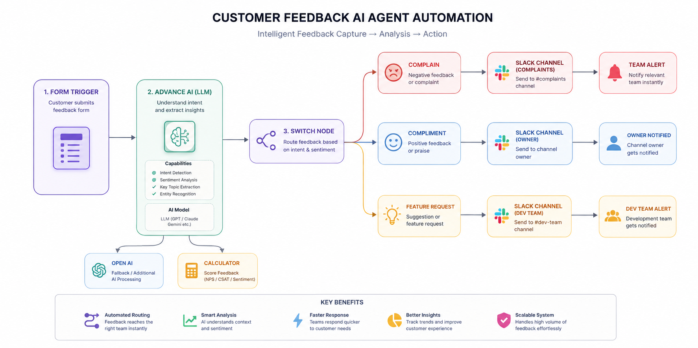
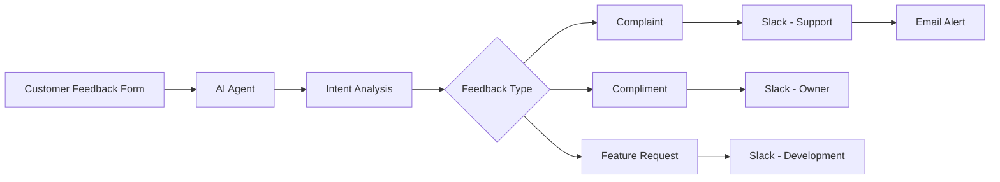

<p align="center">
  
</p>

<h1 align="center">🤖 Customer Feedback AI Agent Automation</h1>

<p align="center">
Intelligently analyze customer feedback, classify intent using AI, and automatically route the request to the right team through Slack.
</p>

<p align="center">


</p>

---

# 📌 Purpose & Scope

Managing customer feedback manually becomes difficult as businesses scale.

This workflow automates the entire feedback handling process by using an AI Agent to understand the customer's message, classify its intent, and instantly notify the appropriate team.

### The automation can identify

- 🚨 Complaints
- ❤️ Compliments
- 💡 Feature Requests

After classification, the workflow automatically routes each feedback type to the correct Slack channel while optionally triggering additional actions such as email notifications, ticket creation, or CRM updates.

---

# 🎯 Trigger

The workflow starts whenever a customer submits a feedback form.

### Supported sources

- Website Contact Form
- Feedback Portal
- Google Forms
- Typeform
- CRM Form Submission
- API Request

---

# ⚡ Actions

## 🧠 AI Analysis

The AI Agent receives the customer message and performs:

- Intent Detection
- Sentiment Analysis
- Topic Extraction
- Response Classification

The workflow can also calculate additional metrics such as:

- Customer Satisfaction Score
- NPS
- CSAT
- Custom Priority Score

---

## 🔀 Smart Routing

After analysis, the workflow automatically routes the feedback into one of three paths.

| Feedback Type | Action |
|--------------|--------|
| 🚨 Complaint | Send notification to Customer Support Slack channel |
| ❤️ Compliment | Notify Owner / Customer Success Team |
| 💡 Feature Request | Notify Product / Development Team |

---

## 📩 Notifications

Depending on the classification, the workflow can automatically:

- Send Slack Notifications
- Send Email Alerts
- Create Support Tickets
- Log Feedback
- Update CRM
- Store Analytics

---

# 🚀 Workflow Overview

```text
Customer Form
      │
      ▼
AI Analysis (LLM)
      │
      ▼
Merge Results
      │
      ▼
Switch / Intent Detection
      │
 ┌────┼──────────────┐
 ▼    ▼              ▼
Complaint   Compliment   Feature Request
 ▼             ▼               ▼
Slack        Slack          Slack
Support      Owner          Dev Team
 ▼
Email Alert (Optional)
```

---

# 🖼 Workflow Screenshot

<p align="center">

</p>

---

# ✨ Features

- 🤖 AI Powered Classification
- 😊 Sentiment Analysis
- 🔀 Automatic Workflow Routing
- 💬 Slack Notifications
- 📧 Email Alerts
- 📊 Customer Feedback Analytics
- ⚡ Real-Time Processing
- 🧩 Modular & Easy to Extend

---

# 🛠 Tech Stack

| Tool | Purpose |
|------|---------|
| n8n | Workflow Automation |
| OpenAI | Intent & Sentiment Analysis |
| Slack | Team Notifications |
| Gmail | Email Alerts |
| JavaScript | Workflow Logic |

---

# 📈 Workflow Benefits

- Saves hours of manual work
- Instantly routes customer feedback
- Improves response time
- Eliminates human error
- Keeps every team informed
- Easily scalable for growing businesses

---

# 🔄 Workflow Flow



---

# 📬 Output

Depending on the customer's feedback, the automation instantly delivers:

- Correct Team Notification
- Slack Message
- Email Alert (Optional)
- Structured Feedback Data
- AI Classification Result

---

<p align="center">

Made with ❤️ using **n8n**, **OpenAI**, and **Slack**

</p>
